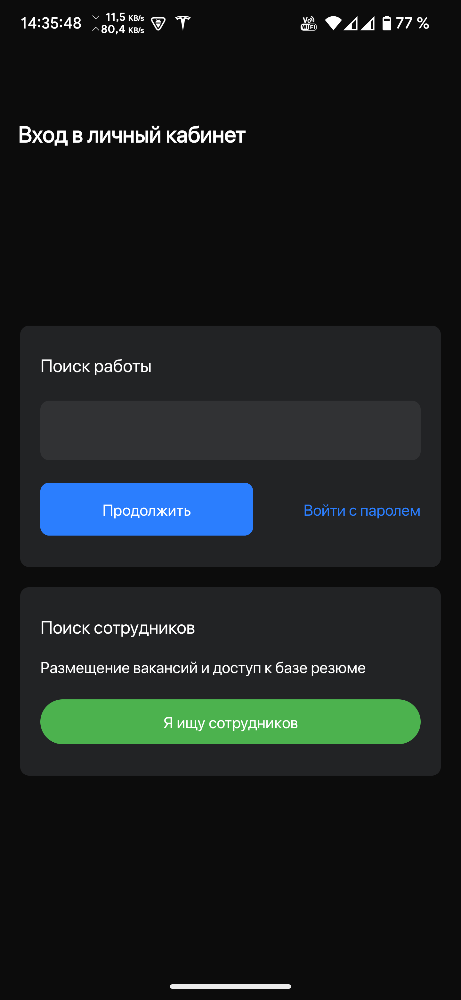
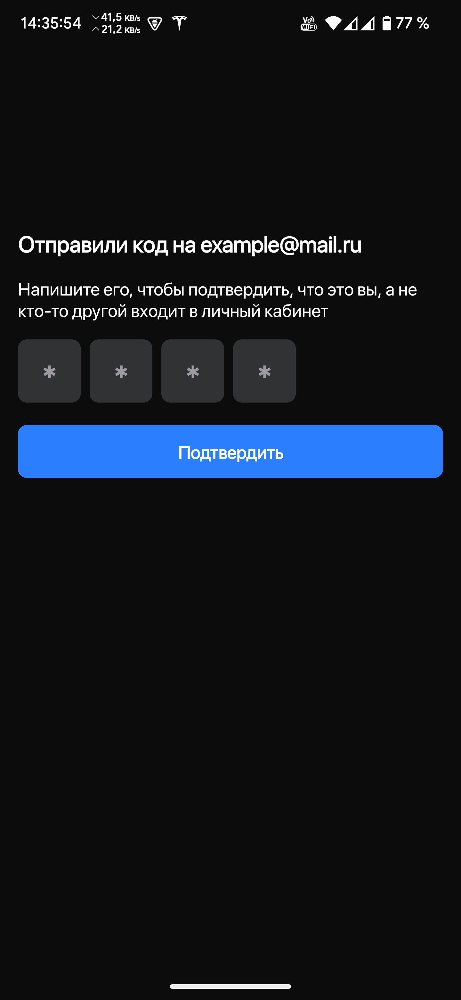
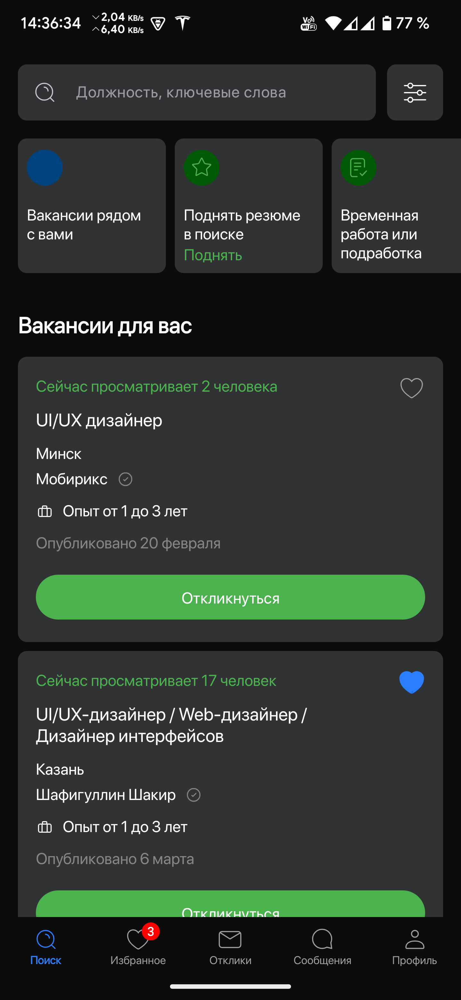
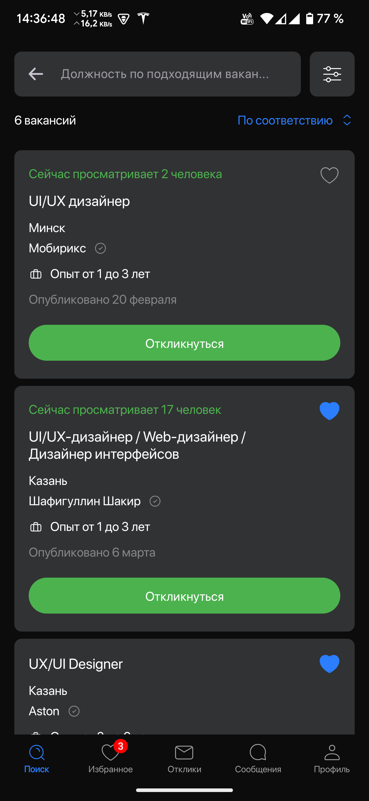
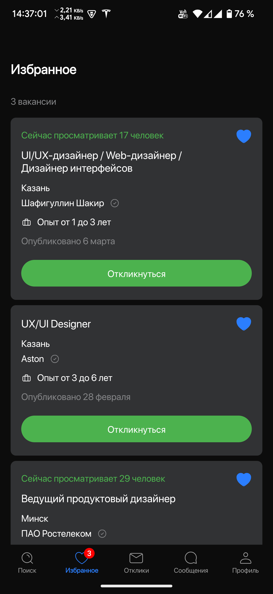
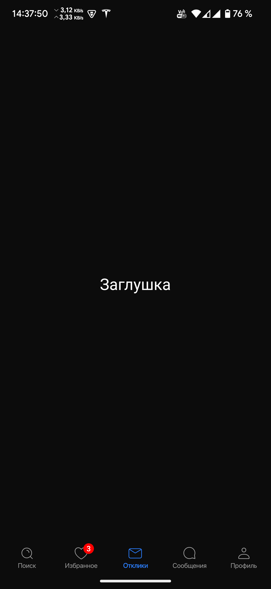

# Тестовое задание для Effective Mobile

## Описание
Данное приложение реализовано согласно техническому заданию.

## Ссылки
- [Техническое задание](https://docs.google.com/document/d/15MkPXaen2j5oe-8ViUUnondUtGN6fnHCZnVnrmTmMnY/edit)
- [Макеты в Figma](https://www.figma.com/file/5n1Y5yxk3AnAbQ7g0ZfROG/Effective-Mobile.-%D0%A2%D0%B5%D1%81%D1%82%D0%BE%D0%B2%D0%BE%D0%B5-%D0%B7%D0%B0%D0%B4%D0%B0%D0%BD%D0%B8%D0%B5-%D0%B4%D0%BB%D1%8F-%D1%80%D0%B0%D0%B7%D1%80%D0%B0%D0%B1%D0%BE%D1%82%D1%87%D0%B8%D0%BA%D0%BE%D0%B2.-%D0%9F%D1%80%D0%B8%D0%BB%D0%BE%D0%B6%D0%B5%D0%BD%D0%B8%D0%B5-%D0%B4%D0%BB%D1%8F-%D0%BF%D0%BE%D0%B8%D1%81%D0%BA%D0%B0-%D0%B2%D0%B0%D0%BA%D0%B0%D0%BD%D1%81%D0%B8%D0%B9?type=design&mode=design&t=oGr9aoEVcyeKdrnh-0)
- [Ссылка для получения данных (API)](https://drive.usercontent.google.com/u/0/uc?id=1z4TbeDkbfXkvgpoJprXbN85uCcD7f00r&export=download)
- [Скачать готовый APK](https://github.com/Den-88/TestTaskEffectiveMobile/releases/download/release/EffectiveMobile.apk)

## Скриншоты

<table>
  <tr>
    <td></td>
    <td></td>
    <td></td>
  </tr>
  <tr>
    <td></td>
    <td></td>
    <td></td>
  </tr>
</table>

## Разработчик
**Шакуров Денис Дамирович**